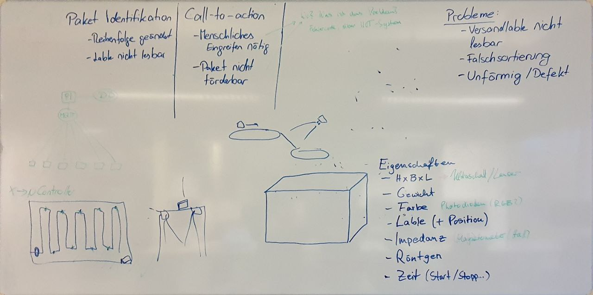

# Dokumentation
Doku über geplante Architketur

## Problemstellung
Pakete werden über langes Paketförderband durch eine Halle transportiert. Ziel ist es die Pakete auf ihrer Reise durch die Versandhalle zu verfolgen.
Die Pakete sollen dafür eindeutige identifiziert werden über:
- Erfassung von Merkmalen
- Auswertung der Merkmale
	- Reduktion manueller Nacharbeit
	- wo sind Pakete defekt?
- Label kann evtl. nicht gelesen werden
- Pakete ändern Ihre Reihenfolge auf dem Förderband
- Pakete zwischen 50mmx50mmx10mm bis 500mmx500mmx500mmx
- Paketband bewegt sich mit 2m/s

## Paketeigenschaften
Eigenschaften eines Pakets mit Hilfe derer ein Paket identifiziert werden kann
- Maße (h x b x t)
- Gewicht
- Farbe
- Lable (+ Postion des Labels auf Paket)
- Impedanz
- Zeitstempel (Wann ist Paket wo)

## Aufbau 
Geplant sind viele einzelne Microcontroller entlang dem Förderband, die das Paket regelmäßg identifizieren. Und ihre gemessenen Paketeigenschaften an einen RaspberryPi senden. Datenkommunikatoin zwischen den Controllern und Pi geplant über Message Broker. Auf dem Pi werden Messwerte in einer Datenbank abgelegt.

